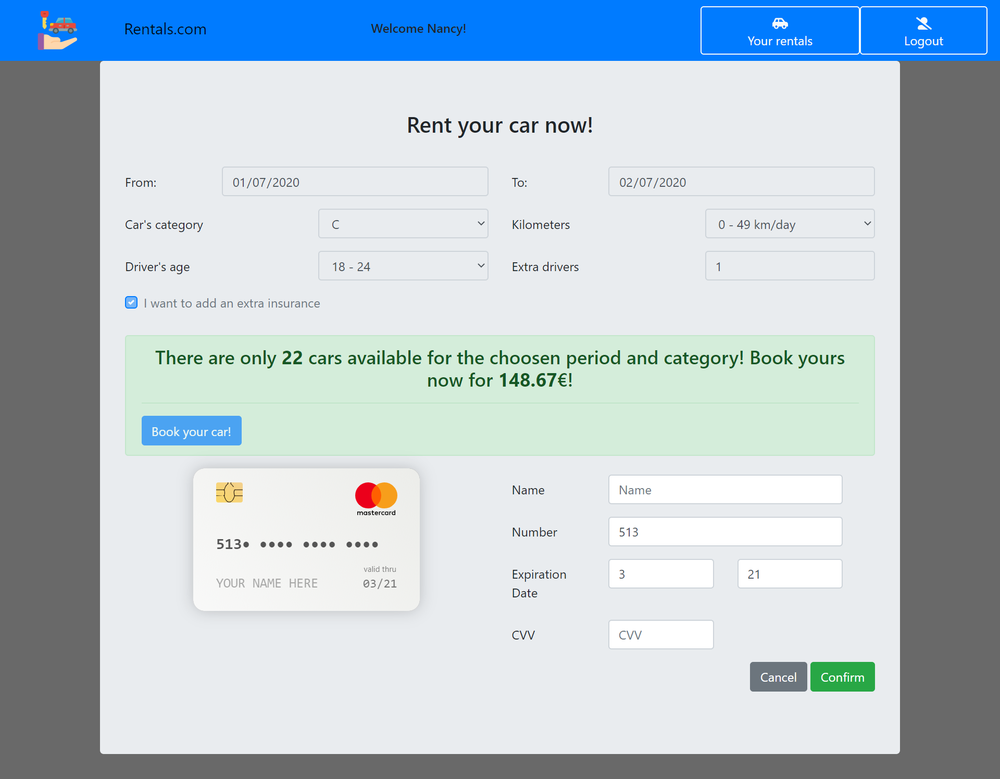

# Car Rental - URBANELLI ANGELICA
## Exam project of Web Application I course

The application's requirement are explained in the Requirements.pdf file.

To run the application the instructions are the following :
  - firstly launch the server:
    - `cd server`
    - `npm install`
    - `npm install -g nodemon` ( if not yet installed )
    - `nodemon`
 - then, in another terminal, launch the client
    - `cd client`
    - `npm install`
    - `npm start`
    
 this will start a web application in developement mode.
 
 ## Test users
|Username | Password | Frequent customer|
|-|-|-|
|angelica| test| no |
|johnny| apassword| no |
|nancy| nancypwd |yes |
|jody| curtis89|no|
|cam| camille.moss|yes|

## React client application routes
- Route  `/` or any invalid route: redirects to `/catalogue` 
- Route `/catalogue`: is the pages that shows available vehicles; it is the only one accessible to the unauthenticated user. The authenticated one can also access it with few differences
- Route `/login`: contains the login form in order to authenticate a user; if the user is already authenticated, redirects to `/user/newrental`
- Route `/user`: is the route that contains the routes for the reserved area
  - Route `/user/newrental`: is the page where an authenticated user can select the parameters of a new rental and perform the payment in case there is at least one car available; if the user is not authenticated, or the authentication token expires, redirects to `/login`
  - Route `/user/rentals/:when`: check if "when" is "future" or "past" and select the appropriate route (if when is neither future, nor past, select future); if the user is not authenticated, or the authentication token expires, redirects to `/login`
    - Route `/user/rentals/future`: is the page where a user can see future rentals, and eventually delete the future ones that are not already started
    - Route `/user/rentals/past`: is the page where a user can see past rentals

## REST API server

- GET `/api/login`
  - request parameters: none
  - request body: empty
  - response body: contains the name of the user if it was already authenticated (the token already contained the id), otherwise returns 401
- POST `/api/login`
  - request parameters: none
  - request body: contains an object with username and password
  - response body: contains the name of the user if the credentials were right, otherwise returns 401
- POST `/api/logout` 
  - request parameters: none
  - request body: empty
  - response body: empty, it just clears the cookie
- GET `/api/vehicles`
  - request parameters: none
  - request body: empty
  - response body: an array of Vehicle object, an error code in case of problems

The following REST APIs are allowed only from an authenticated user. If he/she is not authenicated (either because the token was never signed or because it expired), they return a response with 401 as status code and containing an object that describes the error.

- GET `/api/vehicles/request`
  - request parameters: query parameters containing all the parameters set in the rentalForm
  - request body: none
  - response body: an object containing the number of available vehicles and the price basing on the received parameters if they are valid, otherwise an error message
- POST `/api/rentals/payment`
  - request parameters: none
  - request body: contains all the parameters of the rental request, the price to be payed and the payment data (credit card number, cvv...)
  - response body: empty if everything ok, otherwise an object containing the error message
- POST `/api/rentals`
  - request parameters: none
  - request body: contains all the parameters of the rental request and the price that has been payed 
  - response body: empty if the rental has been correctly recorded in the db, otherwise an error message
- GET `/api/rentals`
  - request parameters: none
  - request body: empty
  - response body: contains an array of Rental objects or an error message if an error occurs
- DELETE `/api/rentals/:rentalid`
  - request parameters: the id of the rental to be deleted
  - request body: empty
  - response body: empty if everything ok, otherwise an error message

## Server database

- Table `users` :
  | UserId | Name | Surname | Username | Password |
  | --- | --- | --- | --- | --- |
- Table `vehicles` :
  |VehicleId | Category | Brand | Model |
  | --- | --- | --- | --- |
- Table `rentals` :
  |RentalId | VehicleId | UserId | DateFrom | DateTo | AgeDriver | OtherDrivers | Kilometers | Insurance | Price |
  | --- | --- | --- | --- | --- | --- | --- | --- | --- | --- | 

  (AgeDriver and Kilometers are integer from 1 to 3 that indicate the range to which they belong to)
 
## Tip
In order to test the surplus of 10% in a rental price due to a number of available vehicles less than 10% of the ones for a certain category, in the period from 2020-08-01 to 2020-08-10 all the vehicles except one has been rented.

## Main React Components

- `App` (in `App.js`): it is the main component, it manages the routes of the application; on mount retrieves from the db all the vehicles (and keeps them in the a state variable ) and calls the tryLogin API to check if the user was already authenticated.
  -  `AppNavbar` (in `AppNavbar.js` ): it is the navbar of the application, it is showed whatever is the path with some differencies based on the path itself and on the fact that the user is authenticated or not. It can contain the Links to go to the  `/catalogue` page (the link is the logo), to the  `/user/rentals`(future or past) or to the  `/user/newrental` pages, and to go to the  `/login` page or to perform the logout.  
  -  `LoginForm` (in `LoginForm.js` ): it is the component that manages the login. It contains the form and does some front-end validation before submitting it to the server
  -  `Catalogue` (in `Catalogue.js` ): it is the component showed in the `/catalogue` page. Its goal is to show all the available vehicles to the user (authenticated or not) and give him/her the possibility to filter the results basing on brand and/or category. Contains the form with checkboxes to select the categories/brands (at mount they are all unchecked). The vehicles to show are received as props
     -  `VehiclesList` (in `Catalogue.js` ): receive the vehicles and the filters as property, filters the vehicles and renders them in VehiclesRow.
        -  `VehiclesRow` (in `Catalogue.js` ): shows the vehicle's informations. Also a price is showed but it is only indicative, since it considers the optimal situation (for the user) where the highest reduction is applied on the base price for that category. The real price will be showed only when filling in the rental form
  - `UserArea` (in `UserArea.js` ): it is the component that is dedicated to the reserved area of an authenticated user. It manages the rental form, the check on data and its submission, the payment submission, the api call to retrieve number and price of available vehicles. It manages also the routes for the `/user/newrental` and the `user/rentals/future` or `/user/rentals/past` routes.
    - `RentalForm` (in `RentalForm.js` ): contains the rental form, manages some front-end validation on data (also done by the UserArea component before submitting data)
    - `Payment` (in `Payment.js` ): contains and manages the payment form; it uses an external component `Cards` from the `react-credit-cards` library to show a card filled in with the fields inserted in the form
      - `NumberAndPrice` (in `NumberAndPrice.js` ): it shows the number and the price of the available vehicles with the selected properties, or a message error in case of problems or a message saying that there are no cars available
    - `Rentals` (in `Rentals.js` ):  contains the previous/past rentals of the user. Manages the `user/rentals/future`(default) and `/user/rentals/past` routes. On mount retrieve the user's rentals from the server and divide them into past and future ones. Manages also the delete of a rental that ha son yet started
      - `Sidebar` (in `Rentals.js` ): manages the links for the two possible routes (future/past)
      - `RentalList` (in `Rentals.js` ): receives the proper list of rentals and shows them or shows a message if an error occurrs or there are no rentals in that section
        - `RentalRow` (in `Rentals.js` ): shows the rental parameters
        

## Screenshot

